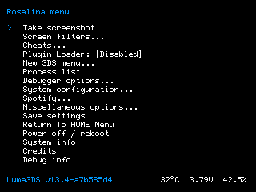

# Luma3DS Fork

*Nintendo 3DS "Custom Firmware" fork based on Luma3DS*




## Description
This is an unofficial custom fork of [Luma3DS](https://github.com/LumaTeam/Luma3DS). It preserves the original Luma3DS functionality while adding extra Rosalina features and quality-of-life improvements.
This fork is not affiliated with or endorsed by LumaTeam, Nintendo, or Spotify.

## Added features

### Music playback controls

This fork adds music playback controls under the Rosalina **Spotify** menu.

Available actions:

* Next track
* Previous track
* Play/Pause toggle
* Play
* Pause
* Playback status
* Hotkey controls

### Global hotkeys

Global playback hotkeys are available while the system is running:

```text
Hold R + Select, then tap:

D-Pad Right = Next track
D-Pad Left  = Previous track
D-Pad Up    = Play/Pause
D-Pad Down  = Playback status
```

### Configuration path

Spotify configuration is stored on the SD card under:

```text
/config/spotify/
```

The token file is expected at:

```text
/config/spotify/token.json
```

## Installation and upgrade

Luma3DS requires [boot9strap](https://github.com/SciresM/boot9strap) to run.

Once boot9strap has been installed, simply download the [latest release archive](https://github.com/LumaTeam/Luma3DS/releases/latest) and extract the archive onto the root of your SD card to "install" or to upgrade Luma3DS alongside the [homebrew menu and certs bundle](https://github.com/devkitPro/3ds-hbmenu) shipped with it. Replace existing files and merge existing folders if necessary.

## Basic usage

**The main Luma3DS configuration menu** can be accessed by pressing <kbd>Select</kbd> at boot. The configuration file is stored in `/luma/config.ini` on the SD card (or `/rw/luma/config.ini` on the CTRNAND partition if Luma3DS has been launched from the CTRNAND partition, which happens when SD card is missing).

**The chainloader menu** is accessed by pressing <kbd>Start</kbd> at boot, or from the configuration menu. Payloads are expected to be located in `/luma/payloads` with the `.firm` extension; if there is only one such payload, the aforementioned selection menu will be skipped. Hotkeys can be assigned to payload, for example `x_test.firm` will be chainloaded when <kbd>X</kbd> is pressed at boot.

**The overlay menu, Rosalina**, has a default button combination: <kbd>L+Down+Select</kbd>. For greater flexibility, most Rosalina menu settings aren't saved automatically, hence the "Save settings" option.

**GDB ports**, when enabled, are `4000-4002` for the normal ports. Use of `attach` in "extended-remote" mode, alongside `info os processes` is supported and encouraged (for reverse-engineering, also check out `monitor getmemregions`). The port for the break-on-start feature is `4003` without "extended-remote". Both devkitARM-patched GDB and IDA Pro (without "stepping support" enabled) are actively supported.

We have a wiki, however it is currently very outdated.

## Building from source

To build Luma3DS, the following is needed:

* git
* [makerom](https://github.com/jakcron/Project_CTR) in `$PATH`
* [firmtool](httpsDS, the following is needed:
* git
* [makerom](https://github.com/jakcron://github.com/TuxSH/firmtool) installed
* up-to-date devkitARM and libctru:

  * install `dkp-pacman` (or, for distributions that already provide pacman, add repositories): https://devkitpro.org/wiki/devkitPro_pacman
  * install packages from `3ds-dev` metapackage: `sudo dkp-pacman -S 3ds-dev --needed`
  * while libctru and Luma3DS releases are kept in sync, you may have to build libctru from source for non-release Luma3DS commits

While Luma3DS releases are bundled with `3ds-hbmenu`, Luma3DS actually compiles into one single file: `boot.firm`. Just copy it over to the root of your SD card ([ftpd](https://github.com/mtheall/ftpd) is the easiest way to do so), and you're done.

## Credits

Special thanks to LumaTeam for their outstanding work on Luma3DS and for greatly improving the user experience of this amazing console.
